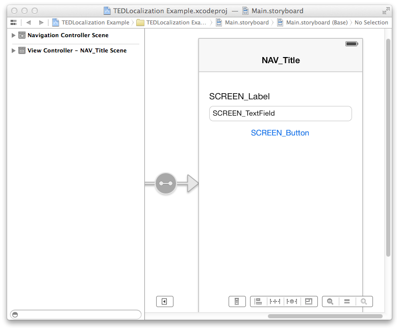
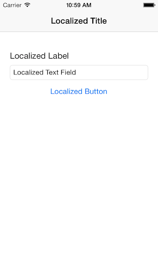

TEDLocalization
===============

[](https://travis-ci.org/technology-ebay-de/TEDLocalization)

`TEDLocalization` will traverse your view hierarchy and localize the view's text strings. It works with `UILabel`s, `UIButton`s, and `UITextField`s. 

## How to use

In your storyboard or XIB, add localization keys to your views:

<p align="center" >
  
</p>

The localization keys map to the entries you added in your `Localizable.strings` file:

```
"NAV_Title" = "Localized Title";
"SCREEN_Label" = "Localized Label";
"SCREEN_TextField" = "Localized Text Field";
"SCREEN_Button" = "Localized Button";
```

When everything is set up, you can call `TEDLocalization` to localize the views:

```
- (void)viewDidLoad
{
    [super viewDidLoad];
    
    [TEDLocalization localize:self];
}
```

<p align="center" >
  
</p>
